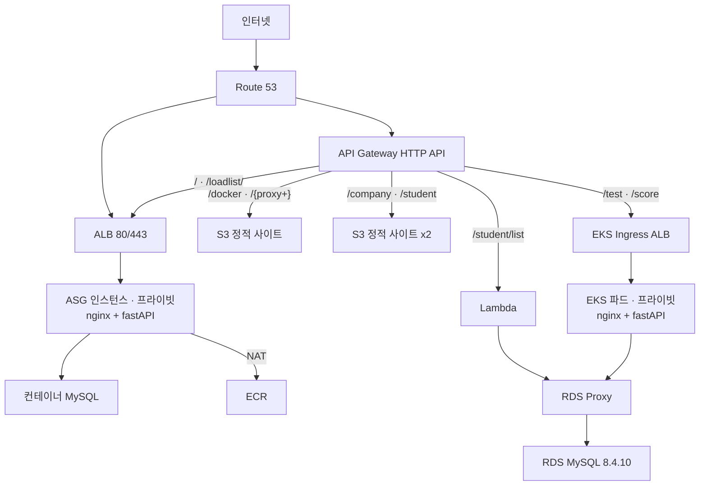

# AWS 하이브리드 3-Tier 아키텍처

정적 사이트 · 컨테이너 앱 · 쿠버네티스 서비스 · 서버리스 API를 **하나의 도메인, 하나의 HTTPS 진입점** 뒤로 통합한 구성입니다. 앱과 DB 계층은 전량 프라이빗 서브넷에 두고, 자격증명은 코드와 YAML에 남기지 않았습니다.

`sa-east-1` · 2일

> 리소스는 정리되어 내려간 상태입니다. 당시 배포했던 설정 파일 원본이며, 민감값만 환경변수로 분리했습니다.

---

## 아키텍처



**S3 웹사이트 엔드포인트는 HTTPS를 지원하지 않습니다.** 인덱스 문서를 쓰려면 웹사이트 엔드포인트여야 하고, 그러면 HTTPS를 잃습니다. API Gateway를 앞단에 두어 HTTPS를 씌우면서 경로별 분배까지 함께 해결했습니다.

| 경로 | 계층 | 내용 |
|---|---|---|
| `q4/` | EC2 | docker-compose, userdata, nginx·fastAPI·MySQL 이미지 빌드 |
| `q9/` | 서버리스 | Lambda 조회 함수 (RDS Proxy 접속) |
| `q10/` | EKS | eksctl 클러스터 정의 (기존 VPC 재사용) |
| `q11/` | EKS | 성적 등록 API, 파드·Ingress 매니페스트, IRSA 정책 |

---

## 설계 판단

**`q4/nginx/default.conf` · `q11/nginx/default.conf`** — fastAPI를 외부에 열지 않고 nginx 리버스 프록시로만 접근시킵니다. 컨테이너는 80 하나만 게시합니다. 3306·8000까지 열면 DB가 인터넷에 노출됩니다.

**`q11/k8s/02-external-secret.yaml`** — DB 자격증명을 YAML에 적지 않습니다. External Secrets Operator가 Secrets Manager에서 읽어 쿠버네티스 Secret으로 동기화하고, 인증은 IRSA라 액세스 키가 클러스터에 저장되지 않습니다.

**`q11/k8s/04-nginx-ingress.yaml`** — 노드가 프라이빗 서브넷에 있어 NodePort로는 외부에서 닿을 수 없습니다. Ingress(ALB)로 노출하고 `target-type: ip` 로 파드에 직접 라우팅합니다. 파드 IP는 계속 바뀌므로 쿠버네티스가 등록·해제를 맡아야 합니다.

**`q10/cluster.yaml`** — `vpc.id` 를 명시해 기존 VPC를 재사용합니다. 지정하지 않으면 eksctl이 VPC를 새로 만들어 RDS와 다른 네트워크가 되고, 파드가 RDS Proxy에 붙지 못합니다. `Name` 태그 중복으로 `CREATE_FAILED` 가 나는 함정도 주석에 적어 두었습니다.

**`q9/lambda-student.py`** — pymysql이 RDS Proxy의 `caching_sha2_password` 클라이언트 인증을 통과하지 못해 `1045 Access denied` 가 납니다. 프록시의 `ClientPasswordAuthType` 만 `MYSQL_NATIVE_PASSWORD` 로 내리면 클라이언트↔프록시 구간만 바뀌고 프록시↔DB는 그대로라 DB 측 보안 수준은 유지됩니다. TLS 옵션이 `ssl={"ssl":{}}` 가 아니라 `ssl_ca` 여야 한다는 점도 주석에 있습니다 — 전자는 **오류 없이 무시되어 평문 접속**이 됩니다.

---

## 구성 증빙

운영 중이던 시점의 화면입니다. 콘솔 12장 + 서비스 5장 전체와 각 화면이 어느 설정 파일에 대응하는지는 **[`docs/screenshots/`](docs/screenshots/)** 에 있습니다.

**서비스** — 주소는 `test.totorosi.cloud` 하나이고 경로마다 다른 백엔드가 응답합니다.

| `/` → EC2 | `/docker` → S3 | `/test` → EKS |
|---|---|---|
| [](docs/screenshots/site-home.png) | [](docs/screenshots/site-docker.png) | [](docs/screenshots/site-score.png) |

**인프라**

| | |
|---|---|
| [](docs/screenshots/subnets.png) | **서브넷 9개** — 3AZ × 3계층. 퍼블릭 3개만 「퍼블릭 IPv4 자동 할당 = 예」 |
| [](docs/screenshots/security-group-db-inbound.png) | **db-sg 인바운드 5개** — 전부 보안 그룹 참조, 마지막 줄이 자기 자신 참조 |
| [](docs/screenshots/target-groups.png) | **대상 그룹 2개** — `IP`(파드) 와 `인스턴스`(EC2). ALB가 2개인 이유 |

---

## 실행

```bash
cp .env.example .env    # 값을 채운다
```

**EC2 계층** — compose가 같은 디렉터리의 `.env` 를 직접 읽습니다.

```bash
cd q4 && docker compose up -d
```

**EKS 계층** — eksctl·kubectl은 환경변수를 치환하지 않으므로 `envsubst` 를 거칩니다.

```bash
set -a && . ./.env && set +a
envsubst < q10/cluster.yaml | eksctl create cluster -f -
envsubst < q11/k8s/03-fastapi.yaml | kubectl apply -f -
```

---

## 포함하지 않은 것

**교육기관이 제공한 원본 HTML과 `init.sql`** — 제가 작성한 파일이 아니라 제외했습니다. 아래 Dockerfile들이 이 파일들을 `COPY` 하므로 **그대로는 빌드되지 않습니다.**

| Dockerfile | 필요한 파일 | 성격 |
|---|---|---|
| `q4/mysql/Dockerfile` | `init.sql` | 제공 원본 |
| `q4/nginx/Dockerfile` | `index.html` | 제공 원본 |
| `q4/fastapi/Dockerfile` | `main.py` | 제공 원본 (DB 계정 2줄만 수정) |
| `q11/nginx/Dockerfile` | `score.html` | 제공 원본에 API 연동 추가 |
| `q11/fastapi/Dockerfile` | `rds-global-bundle.pem` | AWS 공개 파일 |

```bash
curl -o q11/fastapi/rds-global-bundle.pem \
  https://truststore.pki.rds.amazonaws.com/global/global-bundle.pem
```

**계정 식별자** — 계정 ID · VPC/서브넷 ID · ACM ARN · RDS 엔드포인트는 여러 사람이 함께 쓰던 교육 계정 정보라 환경변수로 분리했습니다. 리소스 이름(`std15-test-*`)은 `docs/screenshots/` 의 콘솔 화면과 대조할 수 있도록 그대로 두었습니다.
