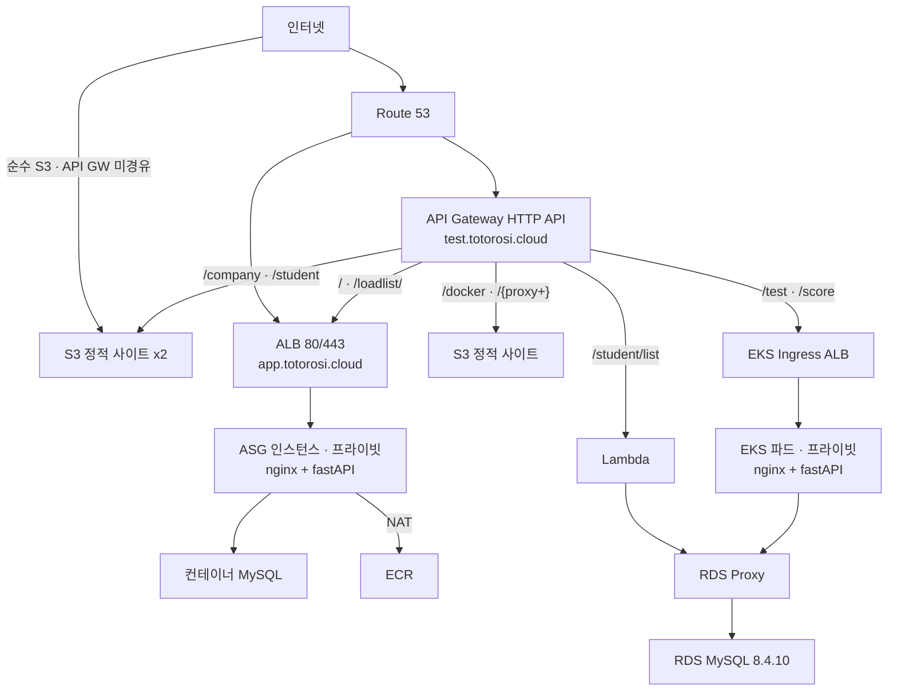
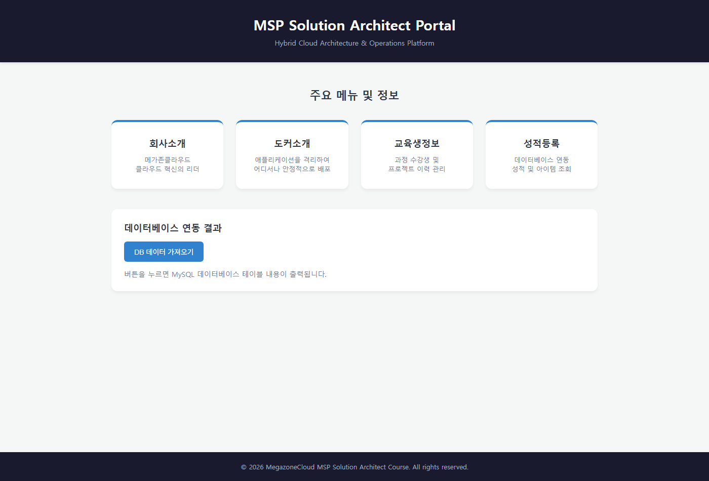
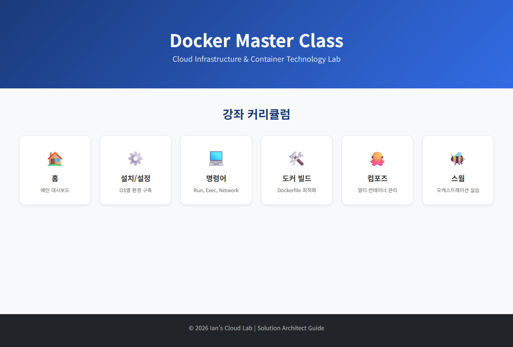
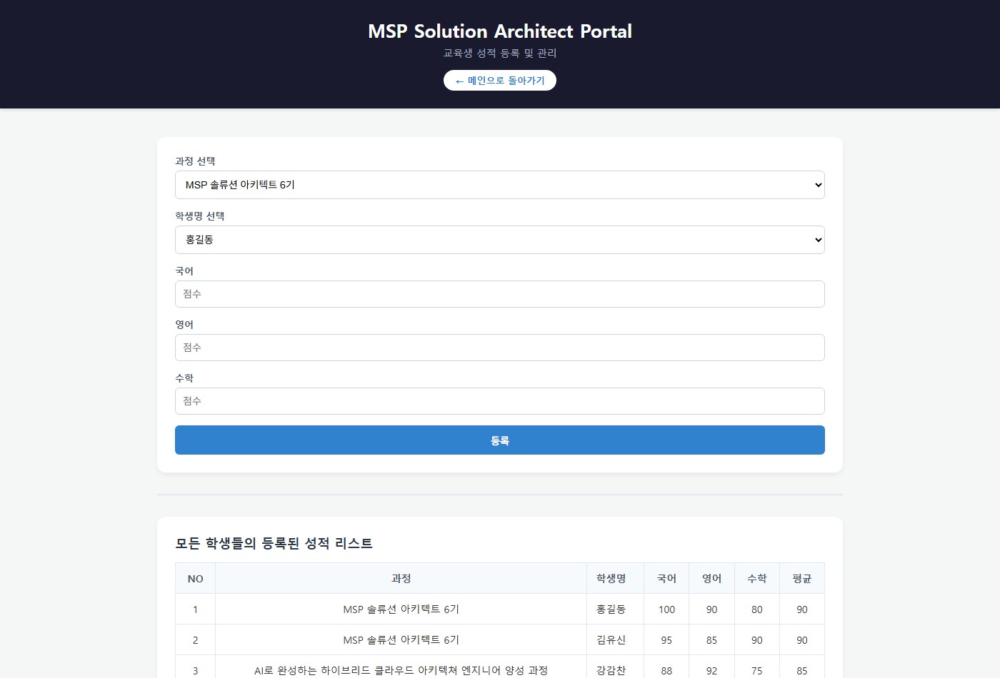
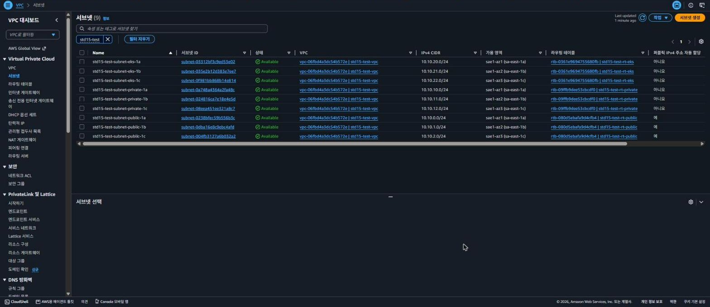
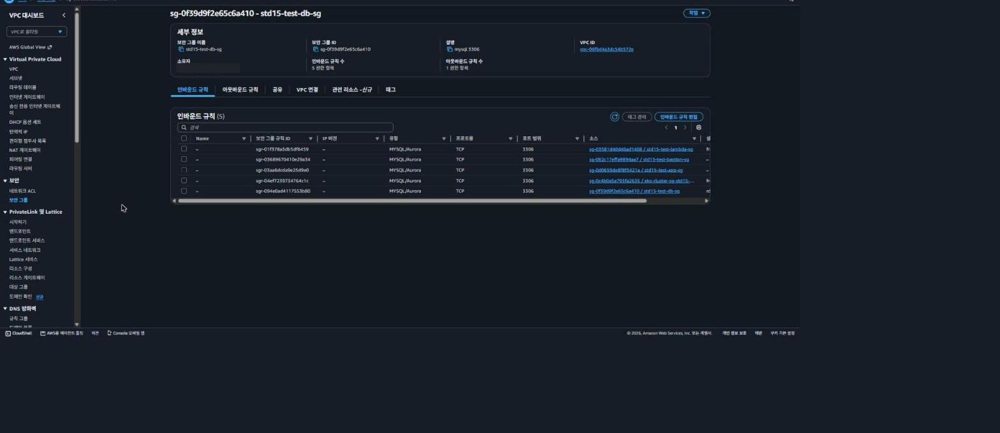
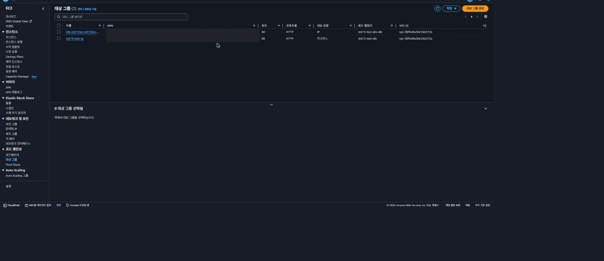

# AWS 하이브리드 3-Tier 아키텍처

정적 사이트 · 컨테이너 앱 · 쿠버네티스 서비스 · 서버리스 API를 **하나의 도메인 뒤로 통합한** 구성입니다. 앱과 DB 계층은 전량 프라이빗 서브넷에 두었습니다.

`sa-east-1` · 2일

**[→ 설계 문서](https://hexagonal-reptile-b60.notion.site/AWS-3-Tier-HTTPS-S3-EC2-EKS-Lambda-3d0ede3bc1c381c898edee908c301754)** — 왜 이 구조인지, 막혔던 지점을 어떻게 뚫었는지, 프로덕션이라면 무엇을 바꿔야 하는지

> 리소스는 정리되어 내려간 상태입니다. 당시 배포에 쓴 파일 원본이며, 민감값만 환경변수로 분리했습니다.

---

## 아키텍처



**S3 웹사이트 엔드포인트는 HTTPS를 지원하지 않습니다.** 인덱스 문서를 쓰려면 웹사이트 엔드포인트여야 하고, 그러면 HTTPS를 잃습니다. API Gateway를 앞단에 두어 HTTPS를 씌우면서 경로별 분배까지 함께 해결했습니다.

도식에서 진입점이 세 개로 보이는 이유입니다.

- **`test.totorosi.cloud` (API Gateway)** — 사용자가 쓰는 주소. 전 구간 HTTPS
- **`app.totorosi.cloud` (ALB 직결)** — ALB의 HTTPS 리스너와 인증서를 API Gateway와 분리해 단독으로 검증하려고 둔 경로
- **S3 웹사이트 주소 직결** — 회사소개·교육생정보 두 버킷은 *순수 S3만으로도 열려야 한다*는 요구사항이 있어 원래 주소를 함께 살려 두었습니다. **이쪽은 HTTP입니다.** 같은 콘텐츠를 HTTPS로 보려면 API Gateway 경로를 씁니다

---

## 이 저장소의 범위

아키텍처 전체가 코드로 되어 있지는 않습니다. **파일로 정의한 부분만** 저장소에 있고, 네트워크·데이터·게이트웨이 계층은 AWS CLI와 콘솔로 만들었습니다.

| 구성 요소 | 어떻게 만들었나 | 위치 |
|---|---|---|
| 컨테이너 3종 이미지 · compose · userdata | 파일 | [`ec2/`](ec2/) |
| 조회 Lambda | 파일 | [`lambda/`](lambda/) |
| EKS 클러스터 · 노드그룹 | 파일 (eksctl) | [`eks-cluster/`](eks-cluster/) |
| 파드 · Ingress · IRSA 정책 | 파일 (kubectl) | [`eks-app/`](eks-app/) |
| VPC · 서브넷 9 · IGW · NAT · 라우팅 테이블 | AWS CLI | — |
| 보안 그룹 5개 (EKS가 자동 생성한 5개는 별도) | AWS CLI | — |
| RDS · RDS Proxy · Secrets Manager | 콘솔 | — |
| S3 버킷 4 · API Gateway · Route 53 · ACM | 콘솔 | — |
| ALB 2 · 대상 그룹 2 · ASG · 시작 템플릿 | 콘솔 | — |

코드가 없는 부분은 **[`docs/screenshots/`](docs/screenshots/) 의 콘솔 화면이 그 자리를 대신합니다.**

---

## 설계 판단

**`ec2/nginx/default.conf` · `eks-app/nginx/default.conf`** — fastAPI를 외부에 열지 않고 nginx 리버스 프록시로만 접근시킵니다. 컨테이너는 80 하나만 게시합니다. 3306·8000까지 열면 컨테이너 MySQL이 그대로 인터넷에 노출됩니다.

**`eks-app/k8s/02-external-secret.yaml`** — EKS 계층은 DB 자격증명을 YAML에 적지 않습니다. External Secrets Operator가 Secrets Manager에서 읽어 쿠버네티스 Secret으로 동기화하고, 인증은 IRSA라 액세스 키가 클러스터에 저장되지 않습니다. EC2 계층은 여기까지 가지 않고 `.env` 로만 분리했습니다 — 아래 「자격증명 처리」 참조.

**`eks-app/k8s/04-nginx-ingress.yaml`** — 노드가 프라이빗 서브넷에 있어 NodePort로는 외부에서 닿을 수 없습니다. Ingress(ALB)로 노출하고 `target-type: ip` 로 파드에 직접 라우팅합니다. 파드 IP는 계속 바뀌므로 등록·해제를 쿠버네티스가 맡아야 합니다.

**`eks-cluster/cluster.yaml`** — `vpc.id` 를 명시해 기존 VPC를 재사용합니다. 지정하지 않으면 eksctl이 VPC를 새로 만들고, 그러면 RDS와 다른 네트워크가 되어 파드가 RDS Proxy에 붙지 못합니다. `Name` 태그 중복으로 `CREATE_FAILED` 가 나는 함정도 주석에 적어 두었습니다.

**`lambda/lambda-student.py`** — pymysql이 RDS Proxy의 `caching_sha2_password` 클라이언트 인증을 통과하지 못해 `1045 Access denied` 가 납니다. 프록시의 `ClientPasswordAuthType` 만 `MYSQL_NATIVE_PASSWORD` 로 내리면 클라이언트↔프록시 구간만 바뀌고 프록시↔DB는 그대로라 DB 측 보안 수준은 유지됩니다. TLS 옵션이 `ssl={"ssl":{}}` 가 아니라 `ssl_ca` 여야 한다는 점도 주석에 있습니다 — 전자는 **오류 없이 무시되어 평문으로 접속**됩니다.

### 자격증명 처리 — 계층마다 다릅니다

| 계층 | 방식 | 저장 위치 |
|---|---|---|
| EKS | Secrets Manager → ESO → 쿠버네티스 Secret, 인증은 IRSA | 클러스터에 평문 없음, 액세스 키 없음 |
| EC2 | `.env` 를 S3 비공개 객체로 두고 IAM 으로만 내려받음 | 인스턴스 디스크에 평문으로 존재 (`chmod 600`) |

**EC2 계층은 EKS만큼 하지 못했습니다.** 컨테이너 MySQL이 `MYSQL_PASSWORD` 환경변수를 요구하고, 제공된 `main.py` 가 접속 정보를 파일 상수로 갖고 있어서입니다. 그래서 `3306` 을 열지 않는 것이 더 중요해졌습니다.

### 장애를 감지하지 못하던 헬스체크

ASG 헬스체크를 `ELB` 로 두어 "컨테이너가 죽으면 인스턴스를 교체"하도록 구성했는데, 검사 경로가 `/` 였습니다. `/` 는 **nginx가 돌려주는 정적 파일**이라 fastAPI나 MySQL이 죽어도 nginx만 살아 있으면 계속 200을 반환합니다. 타겟이 영원히 healthy로 남는 구조였습니다.

경로를 `/loadlist/items` 로 바꿨습니다. nginx → fastAPI → MySQL 전 구간을 거치므로 어느 하나가 죽으면 200이 아니게 됩니다. 대상 그룹 설정만 바꿔 이미지 재빌드 없이 적용했습니다.

설정만 보고 넘기지 않고 **의도적으로 장애를 주입해** 확인했습니다. ASG 자동교체를 정지시킨 뒤 fastAPI 컨테이너를 종료했습니다.

```
[curl · ALB 경유]
  /loadlist/items  ->  504
  /                ->  200      기존 경로. 백엔드가 죽어도 이 값은 안 변한다

[대상 그룹 상태 검사]
  Target.ResponseCodeMismatch  codes: [502]  ->  unhealthy
```

두 관측자가 서로 다른 코드를 봅니다. 상태 검사는 nginx가 즉시 돌려준 `502` 를 기록했고, ALB를 통과한 curl 은 게이트웨이 타임아웃인 `504` 를 받았습니다. **어느 쪽이든 200이 아니므로 교체가 트리거됩니다** — 이게 바꾸기 전에는 일어나지 않던 일입니다.

검사 경로는 [`ec2/nginx/default.conf`](ec2/nginx/default.conf) 의 `/loadlist/` 프록시 규칙과 맞물립니다. 감시 체계는 **실제로 실패시켜 봐야** 검증됩니다.

---

## 구성 증빙

운영 중이던 시점의 화면입니다. 콘솔 12장 + 서비스 5장 전체와 각 화면의 근거는 **[`docs/screenshots/`](docs/screenshots/)** 에 있습니다.

**서비스** — 주소는 `test.totorosi.cloud` 하나이고 경로마다 다른 백엔드가 응답합니다.

| `/` → EC2 | `/docker` → S3 | `/test` → EKS |
|---|---|---|
| [](docs/screenshots/site-home.png) | [](docs/screenshots/site-docker.png) | [](docs/screenshots/site-score.png) |

**인프라**

| | |
|---|---|
| [](docs/screenshots/subnets.png) | **서브넷 9개** — 3AZ × 3계층. 퍼블릭 3개만 「퍼블릭 IPv4 자동 할당 = 예」 |
| [](docs/screenshots/security-group-db-inbound.png) | **db-sg 인바운드 5개** — 전부 보안 그룹 참조, 마지막 줄이 자기 자신 참조 |
| [](docs/screenshots/target-groups.png) | **대상 그룹 2개** — `IP`(파드) 와 `인스턴스`(EC2). ALB가 2개인 이유 |

---

## 실행

VPC·서브넷·보안 그룹·RDS·S3·API Gateway 가 먼저 있어야 하고, 그 ID를 `.env` 에 적습니다.

```bash
cp .env.example .env    # 값을 채운다
```

**EC2 계층** — compose가 같은 디렉터리의 `.env` 를 직접 읽습니다.

```bash
cd ec2 && docker compose up -d
```

**EKS 계층** — eksctl·kubectl은 환경변수를 치환하지 않으므로 `envsubst` 를 거칩니다.

```bash
set -a && . ./.env && set +a
envsubst < eks-cluster/cluster.yaml | eksctl create cluster -f -
envsubst < eks-app/k8s/03-fastapi.yaml | kubectl apply -f -
```

---

## 포함하지 않은 것

**교육기관이 제공한 원본 HTML과 `init.sql`** — 제가 작성한 파일이 아니라 제외했습니다. 아래 Dockerfile들이 이 파일들을 `COPY` 하므로 **받아서 채워 넣기 전에는 빌드되지 않습니다.**

| Dockerfile | 필요한 파일 | 성격 |
|---|---|---|
| `ec2/mysql/Dockerfile` | `init.sql` | 제공 원본 |
| `ec2/nginx/Dockerfile` | `index.html` | 제공 원본 |
| `ec2/fastapi/Dockerfile` | `main.py` | 제공 원본 (DB 계정 2줄만 수정) |
| `eks-app/nginx/Dockerfile` | `score.html` | 제공 원본에 API 연동 추가 |
| `eks-app/fastapi/Dockerfile` | `rds-global-bundle.pem` | AWS 공개 파일 |

`rds-global-bundle.pem` 은 공개 파일이라 바로 받을 수 있습니다.

```bash
curl -o eks-app/fastapi/rds-global-bundle.pem \
  https://truststore.pki.rds.amazonaws.com/global/global-bundle.pem
```

**계정 식별자** — 계정 ID · VPC/서브넷 ID · ACM ARN · RDS 엔드포인트는 여러 사람이 함께 쓰던 교육 계정 정보라 환경변수로 분리했습니다. 리소스 이름(`std15-test-*`)은 `docs/screenshots/` 의 콘솔 화면과 대조할 수 있도록 그대로 두었습니다.
